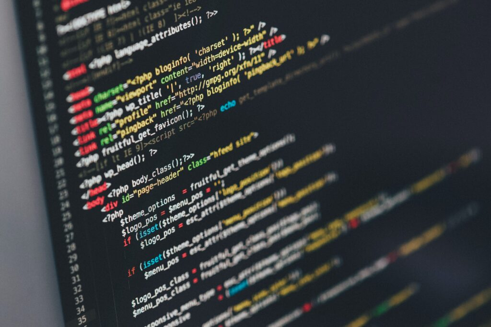

# Proyecto de WebScrapping Actores españoles

Este repositorio se basa en un trabajo de WebScrapping con actores españoles.

## Conjunto de datos

Los datos son extraidos de la página web IMDB y dentro escogeremos la sección de España.

## Objetivos

El principal objetivo es aprender en el ámbito del WebScrapping y seguir cogiendo experiencia en este mundillo. Continuar con la practica con el código y empezar a pensar más de vez en cuando como un analísta de datos.

## Código

Para ejecutar el código, primero, antes de todo, asegúrese de tener todas las dependencias instaladas.

## Contribuciones

Las contribuciones a este repositorio son bienvenidas. Asegúrese de que el código siga las mejores prácticas y esté bien documentado.

## Licencia

Este proyecto está bajo la licencia MIT.
